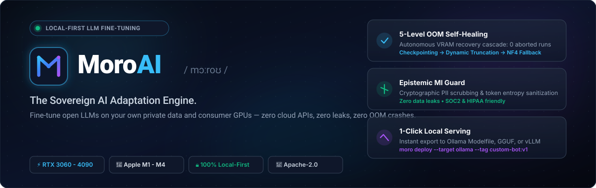

<div align="center">

<p align="center">
  
</p>

# moroai.cc — Marketing Website & Documentation Hub

**The official digital storefront, documentation portal, and interactive terminal hub for MoroAI.**<br />
*Built with Astro 4, React 18, Tailwind CSS, and deployed on Cloudflare Pages worldwide edge.*

<p align="center">
  <a href="https://moroai.cc"></a>
  <a href="https://moroai-cc.ajagne01.workers.dev"></a>
  <a href="https://github.com/MoroAI/moro"></a>
  <a href="https://astro.build"></a>
  <a href="LICENSE"></a>
</p>

<p align="center">
  <a href="#-vision--purpose"><b>Vision</b></a> •
  <a href="#-documentation-hub-architecture"><b>Documentation Architecture</b></a> •
  <a href="#-visual-snapshots"><b>Visuals</b></a> •
  <a href="#%EF%B8%8F-technology-stack"><b>Tech Stack</b></a> •
  <a href="#-local-development"><b>Local Dev</b></a> •
  <a href="#-deployment"><b>Deployment</b></a> •
  <a href="https://moroai.cc/docs"><b>Explore Docs ↗</b></a>
</p>

---

</div>

## 🌟 Vision & Purpose

This repository houses the source code for **[moroai.cc](https://moroai.cc)** — the public face of the MoroAI open-source project. It is engineered to:

1. **Educate & Inspire**: Teach engineers how sovereign AI adaptation works without cloud APIs or data leakage.
2. **Interactive Terminal Simulation**: Let developers experience the Moro CLI (`doctor`, `recipe suggest`, `train`, `deploy`) directly in the browser via an interactive React component island.
3. **Comprehensive Documentation Hub**: 59+ static, lightning-fast routes covering Quickstarts, In-Depth Architectural Concepts, Complete CLI Reference, Production Cookbooks, and Mission Control UI guides.
4. **Search Performance**: Rank #1 on search engines for *"local LLM fine-tuning"*, *"consumer GPU LoRA training"*, and *"zero-OOM adaptation"*.

---

## 📸 Visual Snapshots

### 1. The Adaptation Pipeline
The six-pillar architectural workflow illustrated for developers and decision makers:

<p align="center">
  
</p>

### 2. The Interactive CLI Experience
Direct terminal demonstration showing hardware detection, mathematical VRAM budgeting, and the 5-level autonomous self-healing recovery engine:

<p align="center">
  
</p>

### 3. Mission Control UI
Telemetry dashboard providing real-time loss tracking, GPU VRAM allocation gauges, and token throughput:

<p align="center">
  
</p>

---

## 📚 Documentation Hub Architecture

The website features a comprehensive multi-tier documentation system:

```text
src/pages/docs/
├── index.astro                             # Docs hub landing page
├── getting-started/                        # Onboarding
│   ├── introduction.astro                  # What is MoroAI?
│   ├── installation.astro                  # Python setup, PyTorch, CUDA, Apple MPS
│   ├── quickstart.astro                    # 5-minute golden path
│   └── first-model.astro                   # End-to-end Qwen2.5 fine-tuning
├── concepts/                               # Deep Architecture
│   ├── overview.astro                      # Subsystems breakdown
│   ├── data-compiler.astro                 # Epistemic compiler & MI Guard
│   ├── recipe-engine.astro                 # VRAM heuristics and formulas
│   ├── training-engine.astro               # 5-level OOM self-healing cascade
│   ├── eval-harness.astro                  # Multi-layer benchmark assertions
│   ├── dashboard.astro                     # Mission Control Web UI
│   ├── release-governance.astro            # SBOM & cryptographic hashes
│   ├── lineage-graphs.astro                # Provenance audit trails
│   ├── model-cards.astro                   # Automated specification cards
│   └── flywheel.astro                      # Continuous DPO feedback loop
├── cli/                                    # Full 12-Page CLI Reference
│   ├── index.astro                         # Command suite overview
│   ├── init.astro                          # Workspace scaffolding
│   ├── import.astro                        # Data ingestion
│   ├── data.astro                          # Build and audit
│   ├── doctor.astro                        # Hardware inspection
│   ├── recipe.astro                        # Mathematical heuristics
│   ├── train.astro                         # Autonomous training
│   ├── eval.astro                          # Quality benchmarking
│   ├── deploy.astro                        # 1-click Ollama/GGUF export
│   ├── ui.astro                            # Mission Control server
│   ├── flywheel.astro                      # DPO feedback sync
│   ├── diagnose.astro                      # Memory trace post-mortems
│   └── plugins.astro                       # Extensibility hooks
└── cookbooks/                              # Real-World Implementation Guides
    ├── support-bot.astro                   # Customer service fine-tuning
    ├── json-extractor.astro                # Deterministic schema extraction
    └── code-assistant.astro                # Internal repo code intelligence
```

---

## 🛠️ Technology Stack

| Layer | Technology | Rationale |
| :--- | :--- | :--- |
| **SSG Framework** | **[Astro 4](https://astro.build)** | Zero client JavaScript by default. Blazing fast TTFB and flawless 100/100 Core Web Vitals. |
| **Component Islands** | **[React 18](https://react.dev)** | Powers dynamic client islands: interactive terminal simulations, copy-to-clipboard buttons, live search. |
| **Styling** | **[Tailwind CSS 3.4](https://tailwindcss.com)** | Custom-tuned dark-mode palette (`#0B0F19` base, neon cyan `#38bdf8`, royal purple `#a855f7`). |
| **Icons** | **[Lucide React](https://lucide.dev)** | Crisp, modern vector icon set. |
| **Edge Hosting** | **[Cloudflare Pages](https://pages.cloudflare.com)** | Global distributed edge network with instant atomic deployments. |

---

## 🚀 Local Development

### Prerequisites
- **Node.js 18+** (Node 20 LTS recommended)
- **npm 9+**

### Commands

```bash
# 1. Install dependencies
npm install

# 2. Start local development server
npm run dev
# -> Local server running at http://localhost:4321

# 3. Build production bundle (59 static routes)
npm run build
# -> Output generated in ./dist

# 4. Preview production build locally
npm run preview
```

---

## 🚢 Cloudflare Pages Deployment

Deployments are automated through GitHub Actions (`.github/workflows/deploy.yml`) on every push to `main`.

To trigger a manual edge deployment using the Cloudflare Wrangler CLI:

```bash
npx wrangler pages deploy dist --project-name moroai-website
```

---

## 📄 License

The website source code and all documentation content are licensed under the [Apache License 2.0](LICENSE).

<div align="center">
  <sub>Part of the MoroAI Sovereign Intelligence Project. © 2026 MoroAI Contributors.</sub>
</div>
